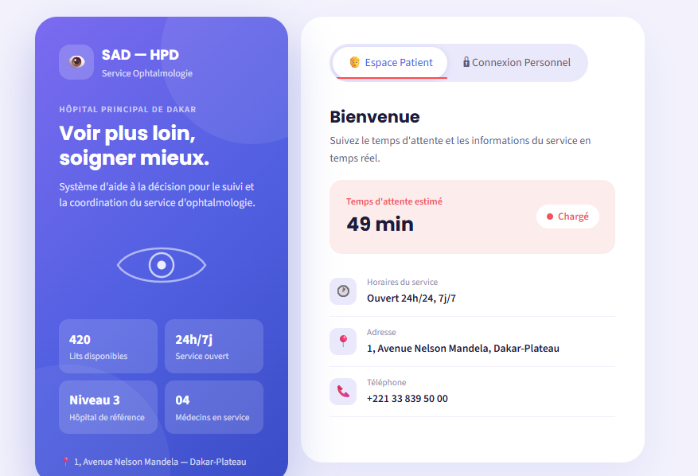
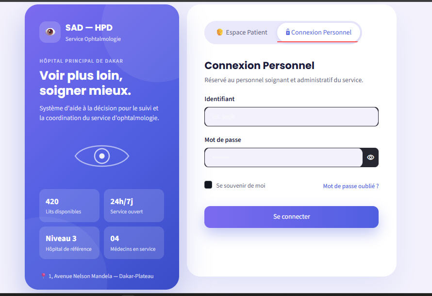
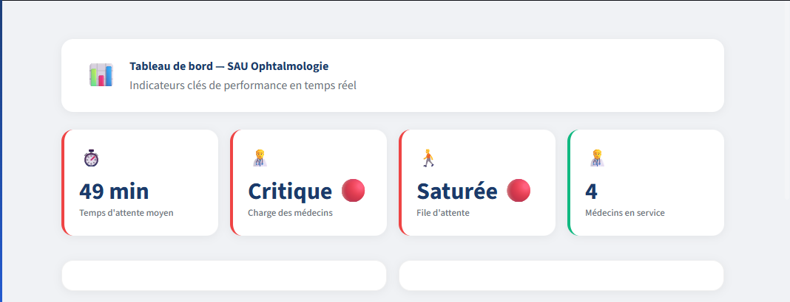
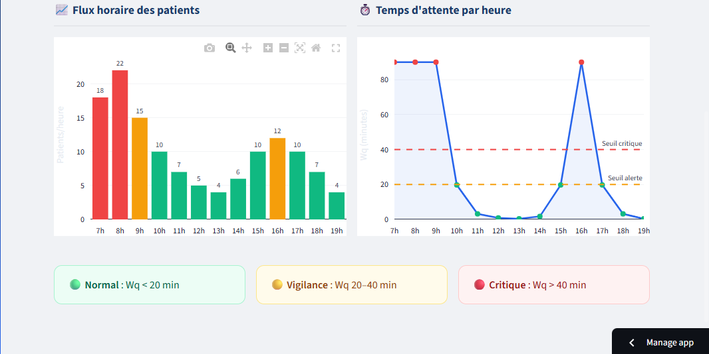
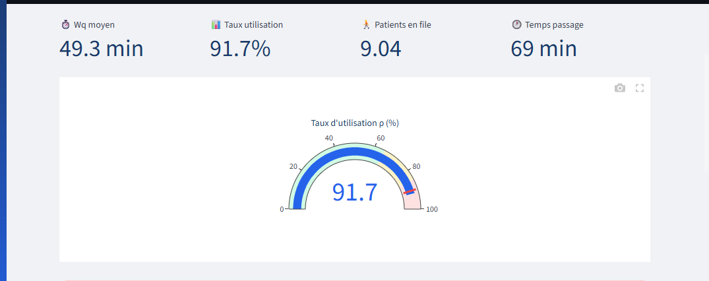
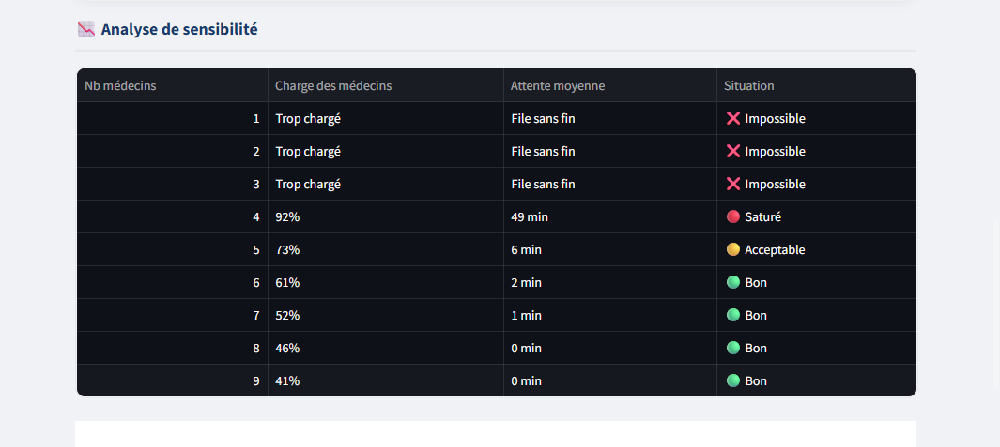
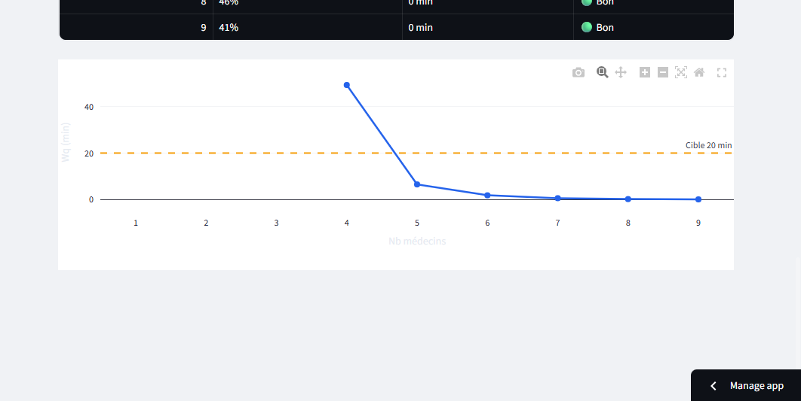

# SAD — HPD : Système d'Aide à la Décision


Projet d'analyse et d'optimisation des temps d'attente au **Service d'Ophtalmologie de l'Hôpital Principal de Dakar (HPD)**.

---

## Présentation du projet

Ce système a été développé dans le cadre d'un projet de fin d'études en Statistique et Informatique Décisionnelle. Il permet d'analyser les flux de patients et de simuler des scénarios d'organisation pour réduire l'attente aux consultations.

Le travail s'appuie sur :
- Une enquête de satisfaction menée auprès de 100 patients
- Des entretiens avec le personnel médical du service
- Une modélisation mathématique basée sur la théorie des files d'attente (modèle M/M/c)
- Une application web interactive sous Streamlit

---

## Fonctionnalités

- **Espace Patient** : consultation du temps d'attente estimé en temps réel
- **Tableau de bord** : suivi des indicateurs clés (temps d'attente moyen, taux d'occupation, flux horaire)
- **Simulateur M/M/c** : test de scénarios d'affectation des médecins
- **Analyse de sensibilité** : évaluation de l'impact des variations d'effectif
- **Recommandations** : pistes d'amélioration organisationnelle

---

## Stack technique

- **Langage** : Python 3.11
- **Interface** : Streamlit
- **Base de données** : PostgreSQL (Supabase)
- **Modélisation** : Théorie des files d'attente (Erlang C)
- **Visualisation** : Plotly
- **Hébergement** : Streamlit Community Cloud

---

## Aperçu de l'application

<p float="left">
  
  
</p>

### Tableau de bord principal


### Analyse du flux horaire


### Taux d'utilisation


### Analyse de sensibilité


### Simulateur de files d'attente


---

## Installation locale

```bash
git clone https://github.com/Maty725/sad-hpd.git
cd sad-hpd
pip install -r requirements.txt
streamlit run app.py


## Structure du projet

```text

sad-hpd/
├── app.py
├── requirements.txt
├── .gitignore
├── README.md
└── screenshots/
    ├── login.png
    ├── tableaubord.png
    ├── flux.png
    ├── jauge.png
    ├── analyse.png
    └── simulateur.png

```
---

Auteure

Maty Mbaye